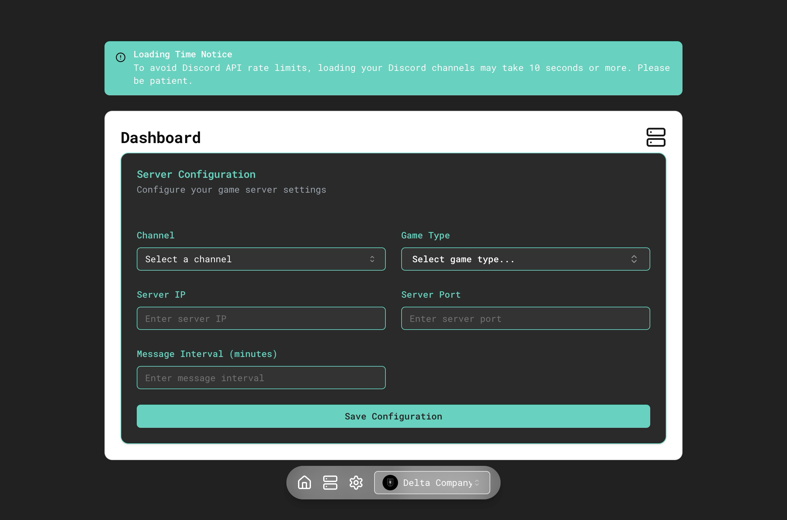
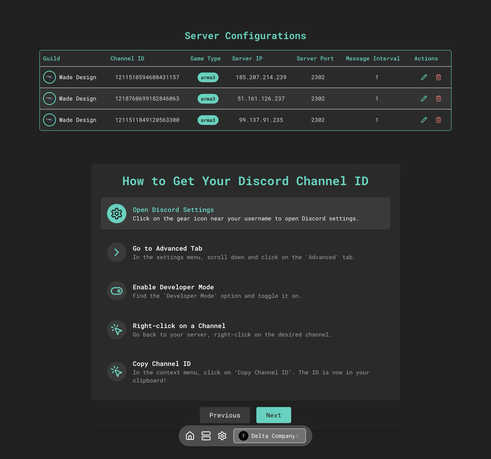
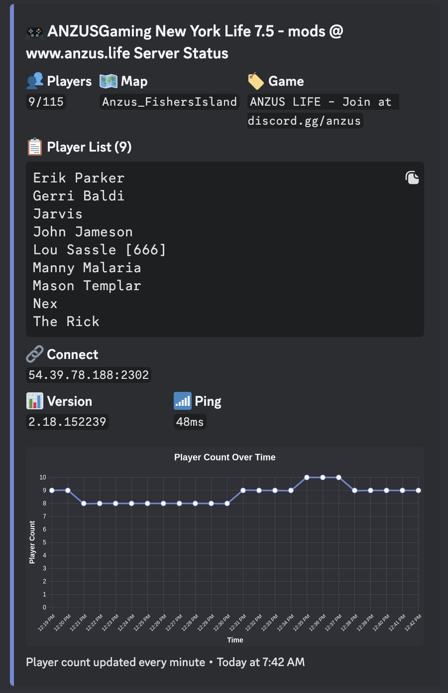
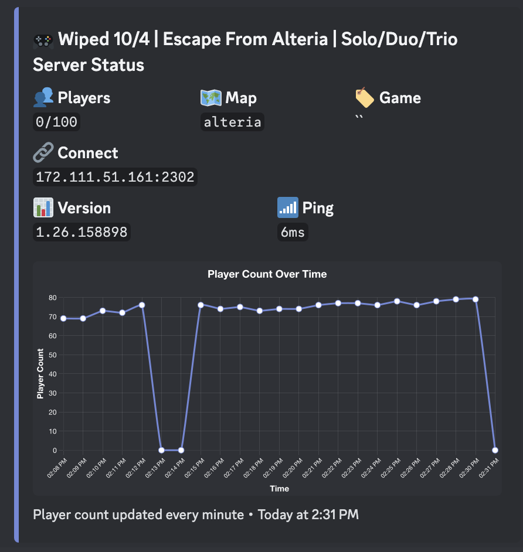

  

  <h1>discord.sentry</h1>

  

    
    
    
  

  

    <strong>The watchful guardian for your game servers. Always on duty, always reporting.</strong>
  

  

    <a href="https://discordsentry.cc">Website</a> | 
    <a href="https://docs.discordsentry.cc">Documentation</a> | 
    <a href="https://discord.gg/discordsentry">Support</a>
  

discord.sentry is a powerful Discord bot and web application designed to monitor and report game server statistics in real-time. It provides server administrators with an easy-to-use interface to configure and manage multiple game servers across various Discord guilds.

<h2>🚀 Features</h2>

<ul>
  <li>🕒 Real-time game server monitoring</li>
  <li>🎮 Support for multiple game types (Minecraft, CS:GO, Arma 3, and more)</li>
  <li>⏱️ Customizable update intervals</li>
  <li>💬 Discord channel integration for server status updates</li>
  <li>📊 Web dashboard for easy configuration and management</li>
  <li>📈 Player count history and graphical representation</li>
</ul>

<h2>🖼️ Preview</h2>

  
  
  
  <h3>Don't want a player list or graph? You've got some checkboxes for that!</h3>
  

<h2>🤔 Why discord.sentry?</h2>

<ul>
  <li><strong>Real-time Monitoring</strong>: Keep your finger on the pulse of your game servers 24/7</li>
  <li><strong>Discord Integration</strong>: Seamless updates right where your community lives</li>
  <li><strong>Multi-Server Support</strong>: Monitor all your game servers from a single dashboard</li>
  <li><strong>User-Friendly</strong>: Easy setup and intuitive web interface for effortless management</li>
</ul>

Don't just monitor your servers, guard them with discord.sentry.

<h2>🚀 Getting Started</h2>

<h3>Prerequisites</h3>

<ul>
  <li>Node.js (v18 or later)</li>
  <li>PostgreSQL database (supabase, vercel postgres, coolify, etc.)</li>
  <li>Discord Bot Token</li>
</ul>

<h2>🖥️ Usage</h2>

<ol>
  <li>Access the web dashboard at <code>http://localhost:3000</code></li>
  <li>Use the server selector in the toolbar to choose a Discord server</li>
  <li>Configure game servers using the provided form</li>
  <li>The bot will automatically start monitoring configured servers and posting updates to the specified Discord channels</li>
</ol>

<h2>How to develop</h2>

<ol>
  <li>Clone the repository</li>
  <li>Run <code>npm install</code></li>
  <li>Run <code>npm run dev</code></li>
  <li>Open <code>http://localhost:3000</code></li>
  <li>In another terminal, run <code>npm run start-updater</code> - should start the bot in the background</li>
</ol>

<h2>🤝 Contributing</h2>

Contributions are welcome! Please feel free to submit a Pull Request.

<h2>📄 License</h2>

This project is licensed under the MIT License.

<h2>🙏 Acknowledgements</h2>

<ul>
  <li><a href="https://nextjs.org/">Next.js</a></li>
  <li><a href="https://discord.com/developers/docs/intro">Discord API</a></li>
  <li><a href="https://github.com/gamedig/node-gamedig">GameDig</a></li>
  <li><a href="https://www.chartjs.org/">Chart.js</a></li>
</ul>

For more detailed information on the project structure and implementation, please refer to the source code and comments within the files.

