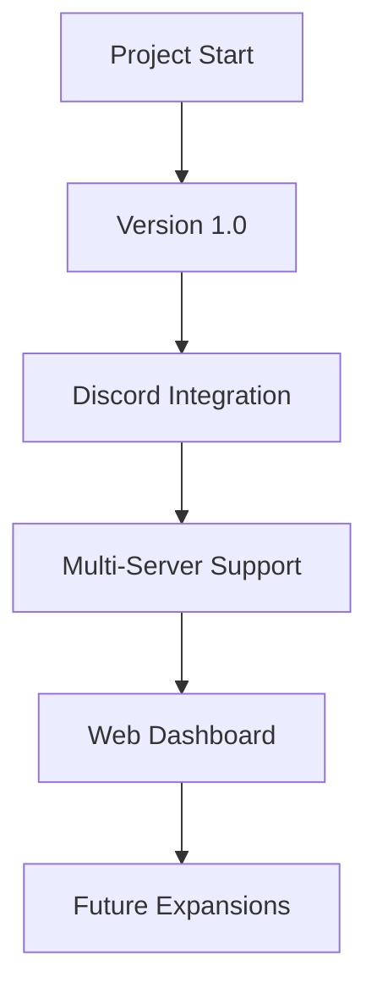

<div align="center">
  

  # Discord.Sentry

  [](https://opensource.org/licenses/MIT)
  [](https://discord.gg/discordsentry)
  [](https://github.com/yourusername/Discord.Sentry/stargazers)

  > The watchful guardian for your game servers. Always on duty, always reporting.

  [Website](https://discordsentry.cc) | [Documentation](https://docs.discordsentry.cc) | [Support](https://discord.gg/discordsentry)
</div>

---

Discord.Sentry is a powerful Discord bot and web application designed to monitor and report game server statistics in real-time. It provides server administrators with an easy-to-use interface to configure and manage multiple game servers across various Discord guilds.

## 🚀 Features

- 🕒 Real-time game server monitoring
- 🎮 Support for multiple game types (Minecraft, CS:GO, Arma 3, and more)
- ⏱️ Customizable update intervals
- 💬 Discord channel integration for server status updates
- 📊 Web dashboard for easy configuration and management
- 📈 Player count history and graphical representation

## 🖼️ Preview

<div align="center">
  
</div>


## 🤔 Why Discord.Sentry?

- **Real-time Monitoring**: Keep your finger on the pulse of your game servers 24/7
- **Discord Integration**: Seamless updates right where your community lives
- **Multi-Server Support**: Monitor all your game servers from a single dashboard
- **User-Friendly**: Easy setup and intuitive web interface for effortless management

Don't just monitor your servers, guard them with Discord.Sentry.

## 🚀 Getting Started

### Prerequisites

- Node.js (v18 or later)
- PostgreSQL database
- Discord Bot Token

### Installation

1. Clone the repository:
   ```
   git clone https://github.com/yourusername/Discord.Sentry.git
   cd Discord.Sentry
   ```

2. Install dependencies:
   ```
   npm install
   ```

3. Set up your environment variables:
   Create a `.env.local` file in the root directory and add the following:
   ```
   DISCORD_BOT_TOKEN=your_discord_bot_token
   DB_URL=your_postgresql_database_url
   ```

4. Initialize the database:
   Run the SQL commands found in `app/utils/ServerMonitor.ts` to set up your database schema.

5. Start the development server:
   ```
   npm run dev
   ```

6. In a separate terminal, start the updater script:
   ```
   npm run start-updater
   ```

## 🖥️ Usage

1. Access the web dashboard at `http://localhost:3000`
2. Use the server selector in the toolbar to choose a Discord server
3. Configure game servers using the provided form
4. The bot will automatically start monitoring configured servers and posting updates to the specified Discord channels

## 📁 Project Structure

- `/app`: Next.js application files
  - `/api`: API routes for server-side operations
  - `/components`: React components
  - `/dashboard`: Dashboard pages
  - `/utils`: Utility functions and server monitor
- `/scripts`: Scripts for running the updater
- `/public`: Static assets

## 🤝 Contributing

Contributions are welcome! Please feel free to submit a Pull Request.

## 📄 License

This project is licensed under the MIT License.

## 🙏 Acknowledgements

- [Next.js](https://nextjs.org/)
- [Discord API](https://discord.com/developers/docs/intro)
- [GameDig](https://github.com/gamedig/node-gamedig)
- [Chart.js](https://www.chartjs.org/)

For more detailed information on the project structure and implementation, please refer to the source code and comments within the files.

## 📈 Project Growth

<div align="center">



</div>

---

<div align="center">
  Made by the Delta Co Dev Team
</div>
